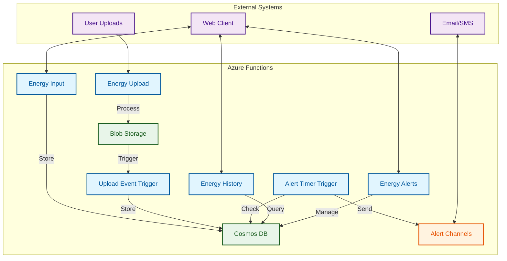

## Deliverables

Deployed app url: https://gray-sand-04ca9ed1e.6.azurestaticapps.net/

My app heavily uses Azure Functions and Azure static web apps. To run locally, you may need to install both.

- https://github.com/Azure/azure-functions-core-tools
- https://github.com/Azure/static-web-apps

## Running the app locally
Run `npx swa build` then `npx swa start`
If this doesn't work you may need to install static web apps as a dev or regular dependency. You will also need to install azure functions core tools, using the links above - the getting started sections.

## Project Core Deliverables

✅ **User Authentication**
- Implemented using Azure Static Web Apps authentication
- Secure access to all API endpoints

✅ **Manual Data Input**
- Implemented via `/energy-input` endpoint
- Accepts date and usage values
- Stores data in Cosmos DB
- Validates input data

✅ **File Uploads**
- Implemented via `/energy-upload` endpoint
- Uses Azure Blob Storage for file storage
- Processes CSV files with proper validation
- Supports bulk csv data import

✅ **Historical Insights**
- Implemented via `/energy-history` endpoint
- Supports date range filtering
- Returns detailed energy usage data
- Can be used for visualization

✅ **Alerts and Notifications**
- Implemented via `/energy-alerts` endpoint
- Supports multiple notification channels (email, SMS)
- Allows setting custom thresholds
- Monitors energy usage against thresholds

### UI Implementation

✅ **Dashboard**
- Modern, responsive design using React and DaisyUI
- Interactive data visualization with Chart.js
- Monthly and daily usage statistics
- CSV file upload interface with progress tracking

✅ **Data Visualization**
- Line chart showing energy usage over time
- Bar chart displaying average monthly usage
- Interactive tooltips and zoom capabilities
- Responsive design that works on all devices

✅ **User Interface Features**
- Modal-based forms for data entry
- Progress indicators for file uploads
- Error handling and success messages
- Responsive tables for data display

✅ **Alert Management**
- Alert history tracking
- Simple alert deletion process

✅ **Documentation**
- Integrated Swagger UI for API documentation
- Accessible from the main navigation
- Interactive API testing interface

### API Implementation

✅ **Authentication**
- Integrated with Azure Static Web Apps auth
- Secure access to all endpoints

✅ **Manual Data Input**
- POST `/energy-input`
- Validates and stores energy usage data

✅ **File Upload**
- POST `/energy-upload`
- Processes CSV files
- Validates data format

✅ **Historical Data**
- GET `/energy-history`
- Supports date range filtering
- Returns detailed usage data

✅ **Alerts**
- POST `/energy-alerts`
- Manages alert thresholds
- Configures notification channels

### Architecture Implementation

✅ **API Gateway**
- Implemented using Azure Functions
- RESTful endpoints documented in OpenAPI spec
- Proper error handling and status codes

✅ **Backend Compute**
- Azure Functions for all data processing
- Efficient handling of requests
- Proper error handling and logging

✅ **Storage**
- Azure Blob Storage for file uploads
- Cosmos DB for energy data and alerts
- Proper data modeling and indexing

✅ **Authentication**
- Azure Static Web Apps authentication
- Secure access to all resources
- Role-based access control

✅ **Notifications**
- Support for multiple notification channels
- Threshold-based alerting system
- Configurable alert settings

## System Architecture

### API unit tests
There are some unit test written, you can run the tests with `yarn jest`

### Bulk CSV Upload
Template used is like this -
Date,Usage(kWh)
2025-03-01,25
2025-02-01,10
2025-03-10,2.5
2025-05-03,10.2
2025-02-01,3.2
2025-06-01,10.1
2025-03-01,25.6
2025-01-01,22
2026-01-01,22

There are some samples in the /public folder, which you can upload.

## SNS
Using a timer trigger, and querying the database, notifications are sent out at 9AM to the email channel via SendGrid.

### handy commands
- `yarn create vite pge-nrg --template react-ts`
- `swa build`
- `swa login --resource-group pge-rg --app-name pge-nrg`
- `swa deploy --env production`

### handy links
- https://learn.microsoft.com/en-us/azure/static-web-apps/deploy-web-framework?tabs=bash&pivots=react
- https://vite.dev/guide/
- https://azure.github.io/static-web-apps-cli/docs/cli/swa-start/
- https://learn.microsoft.com/en-us/azure/static-web-apps/add-authentication

### Scripts
Runs a script to create a row csv example from test-data.csv template
`awk 'BEGIN {srand(); print "Date,Usage(kWh)"} NR>1 {for(i=0;i<10000; i++) {year=2025+int(rand()*2); month=1+int(rand()*12); day=1+int(rand()*28); printf("%04d-%02d-%02d,%0.1f\n", year, month, day, rand()*100)}}' test-data.csv > example_10k.csv`
