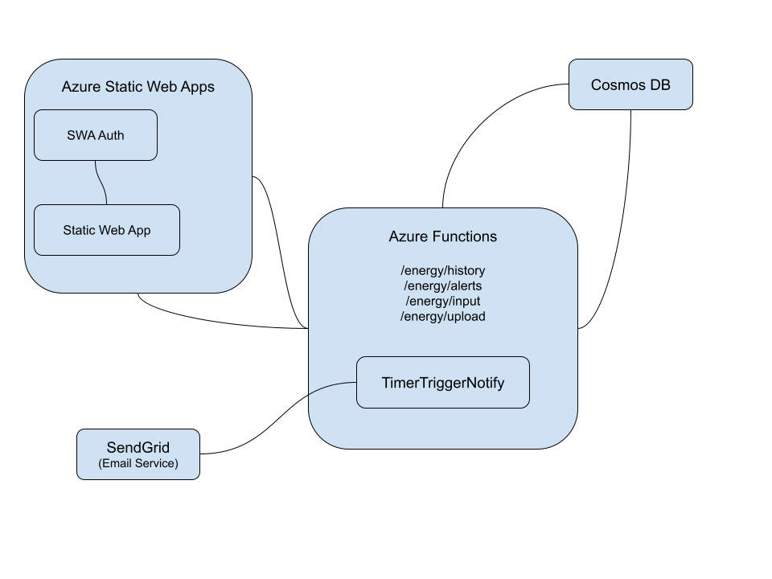

## Deliverables

Deployed app url: https://lively-mud-02baee110.4.azurestaticapps.net/

My app heavily uses Azure Functions and Azure static web apps. To run locally, you may need to install both.

- https://github.com/Azure/azure-functions-core-tools
- https://github.com/Azure/static-web-apps

## Running the app
Run `npx swa build` then `npx swa start`
If this doesn't work you may need to install static web apps as a dev or regular dependency

### Azure flow diagram

### API Documentation
You can view generated JS doc swagger documentation under the /docs url.
There is also a header link in app.

### API unit tests
There are some unit test written, you can run the tests with `yarn jest`

## SNS
TimerTrigger functionality didn't work on the free tier so I moved the processing to an http function, and batched the upload and write to the DB.

If I had more time I would have used Azure Event Grid and either a queue function or just a handler function to send emails when events were fired.

### handy commands
- `yarn create vite pge-nrg --template react-ts`
- `swa build`
- `swa login --resource-group pge-rg --app-name pge-nrg`
- `swa deploy --env production`

### handy links
- https://learn.microsoft.com/en-us/azure/static-web-apps/deploy-web-framework?tabs=bash&pivots=react
- https://vite.dev/guide/
- https://azure.github.io/static-web-apps-cli/docs/cli/swa-start/
- https://learn.microsoft.com/en-us/azure/static-web-apps/add-authentication

### Scripts
Runs a script to create a row csv example from test-data.csv template
`awk 'BEGIN {srand(); print "Date,Usage(kWh)"} NR>1 {for(i=0;i<10000; i++) {year=2025+int(rand()*2); month=1+int(rand()*12); day=1+int(rand()*28); printf("%04d-%02d-%02d,%0.1f\n", year, month, day, rand()*100)}}' test-data.csv > example_10k.csv`

### Bulk CSV Upload
Template used is like this -
Date,Usage(kWh)
2025-03-01,25
2025-02-01,10
2025-03-10,2.5
2025-05-03,10.2
2025-02-01,3.2
2025-06-01,10.1
2025-03-01,25.6
2025-01-01,22
2026-01-01,22

I have the data in the public folder, so you can test given example with this URL -

Postman - `http://<app-url>/api/energy/upload?url=http://<app-url>/example_2500.csv`
